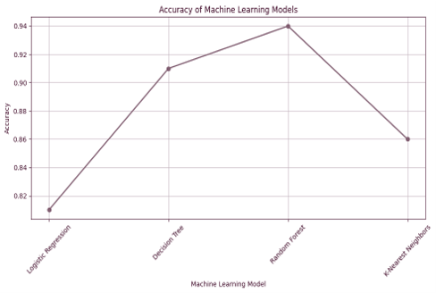
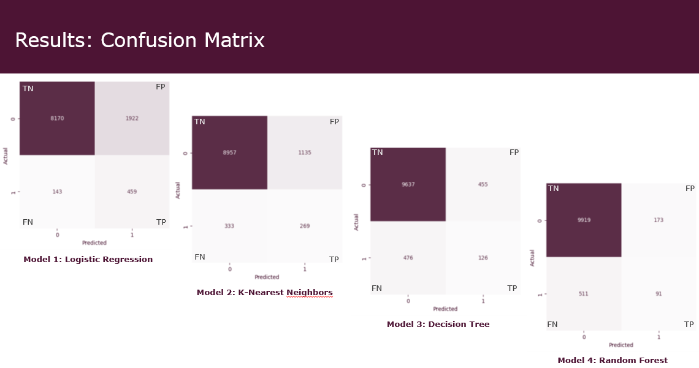

## Patient Survival Risk Prediction Using Machine Learning

## Overview
This project was developed as part of my Master’s thesis in Medical Informatics at Deggendorf Institute of Technology (Germany).

It focuses on analyzing publicly available clinical data and building predictive models to estimate patient survival outcomes.
The project applies supervised machine-learning techniques to classify patients based on survival, and explores clinical factors associated with outcome patterns.

---

## Objectives

- Identify relevant clinical and demographic factors associated with patient survival.
- Develop and evaluate machine learning models to predict survival outcomes.
- Compare the performance of different classification algorithms.
- Present insights clearly using visualizations and evaluation metrics.

---

## Dataset

- **Source**: Public clinical dataset *(used only locally for academic purposes)*
- **Format**: CSV
- **Size**: ~XXX rows × XX columns  
- **Target variable**: Patient survival status (0 = No, 1 = Yes)

- **Note**: The dataset is not included in this repository 
   Please refer to the original data source: [(https://datadryad.org/dataset/doi:10.5061/dryad.v142481)]

---

## Tools & Technologies Used

- **Python:** Pandas, NumPy, scikit-learn, Matplotlib, Seaborn  
- **Jupyter Notebook** for development and analysis  
- **Machine Learning Models:** Logistic Regression, Random Forest, Decision Tree  
- **Evaluation Metrics:** Accuracy, Precision, Recall, F1-score, ROC-AUC, Confusion Matrix

---

## Methodology
1. **Data Cleaning & Preprocessing**  
   - Handling missing values, outliers, normalization
2. **Exploratory Data Analysis (EDA)**  
   - Distribution plots, correlations, and patterns
3. **Feature Selection**  
   - Identifying most influential factors
4. **Predictive Modeling**  
   - Survival prediction using classification models
5. **Visualization & Insights**  
   - Charts and tables highlighting key findings

## Visual Outputs

The project includes several visualizations to evaluate model performance and compare algorithms.  
Below are key outputs from the analysis:

### 🔹 AUC-ROC Curve

### 🔹 Model Accuracy

### 🔹 Confusion Matrix (Random Forest)

### 🔹 Model Comparison (Multiple Algorithms)

---

## Results Summary

- **Best Model:** Random Forest Classifier  
- **Accuracy:** 0.94 (94%)  
- **ROC-AUC Score:** 0.84 (84%)  
- The model shows strong performance, and Random Forest outperforms other tried algorithms.

---

## View Full Analysis

To see the complete workflow, EDA, preprocessing, and evaluation:

1. Open the notebook: `Risk_Prediction_Model.ipynb`
2. Scroll to the evaluation and results sections.
